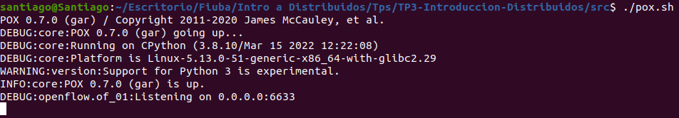
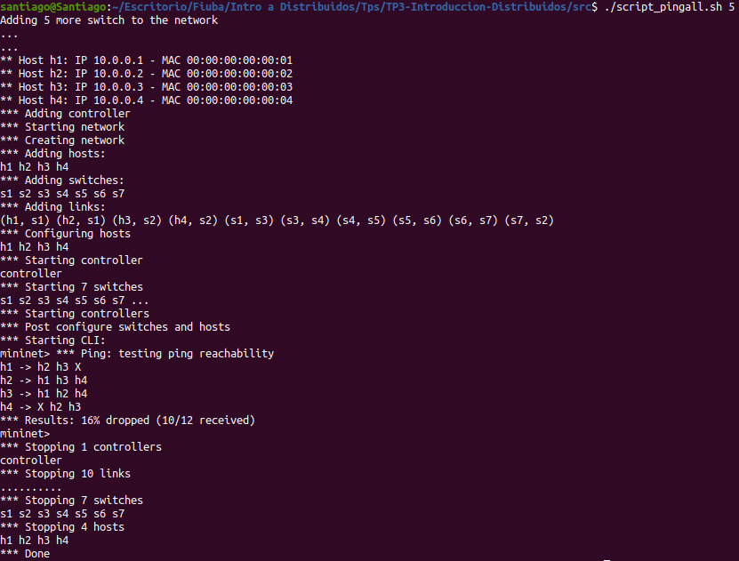
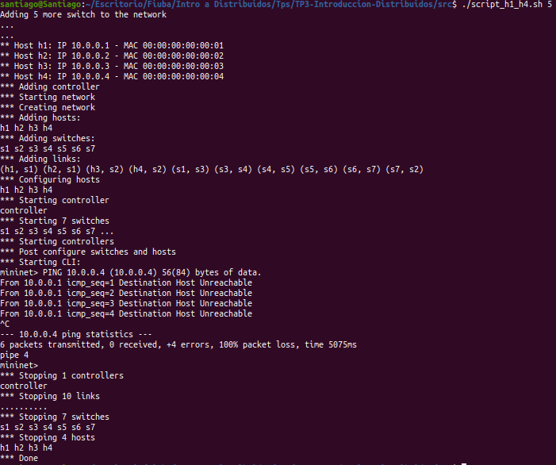
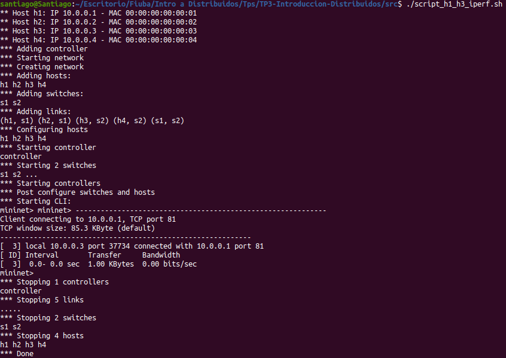
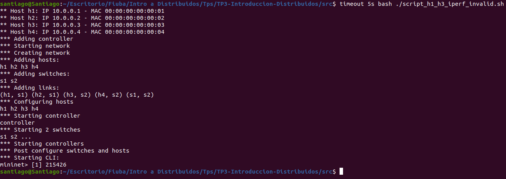

# TP3-Introduccion-Distribuidos

------

# Manual de usuario

## Instalación de mininet:
```shell
sudo apt-get install mininet
pip install mininet
```

## Levantando el controlador de POX:
```shell
cd Codigo
./pox.sh
```

## Levantando la topología:

Dado que la topologia es parametrizable se puede definir la cantidad de switches que la misma va a tener.

```shell
sudo -E python3 main.py -n [number_switches] -v [verbose] -q [quiet]
```

## Agregando reglas

Por default `number_switches` se setea en 0 y es un valor limitado a un maximo de 10, si se ingresa un valor mayor a 10 quedara en 10 por defecto.

Todos los parámetros que se pasan por linea de comando son opcionales.

Las reglas del firewall son configurables, para ello hay que agregarlas en el vector `rules = []` del archivo `Controller/configRules.py`

Los diferentes campos por los cuales se puede filtrar son:

| Campo         | Valor  | Descripcion                                            | Ejemplo                                                      |
| ------------- | ------ | ------------------------------------------------------ | ------------------------------------------------------------ |
| ip_src        | string | IP de origen                                           | ip_src='10.0.0.1'                                            |
| ip_dst        | string | IP de destino                                          | ip_dst='10.0.0.4'                                            |
| mac_dst       | string | MAC Address de destino                                 | mac_dst="00:00:00:00:00:01"                                  |
| mac_src       | string | MAC Address de origen                                  | mac_src="00:00:00:00:00:04"                                  |
| port_dst      | int    | Puerto de destino.                                     | port_dst=80                                                  |
| port_src      | int    | Puerto de origen.                                      | port_src=8080                                                |
| protocol      | string | Opciones: 'UDP', 'TCP', 'ICMP'                         | protocol='UDP'                                               |
| type_ethernet | string | Opciones: pkt.ethernet.IP_TYPE, pkt.ethernet.ARP_TYPE  | type_ethernet=pkt.ethernet.IP_TYPE                           |
| description   | string | Descripción que se quiera cuando se filtra el paquete. | description='Dropping: IP src 10.0.0.1, IP dst 10.0.0.4, protocol=IP' |

Entonces la forma de agregar la regla es instanciar un objeto de tipo `Rule()` pasando como parámetros los campos que se quieran filtrar.

Por ejemplo, dos reglas válidas puede ser las siguientes

```python
Rule(ip_src='10.0.0.1', ip_dst='10.0.0.4',type_ethernet=pkt.ethernet.IP_TYPE, description='Dropping: IP src 10.0.0.1, IP dst 10.0.0.4, protocol=IP')
    
Rule(ip_src='10.0.0.4', ip_dst='10.0.0.1', type_ethernet=pkt.ethernet.IP_TYPE, description="Dropping: IP src 10.0.0.4,IP dst 10.0.0.1, protocol=IP")
```

y las mismas deben ser agregadas en el vector `rules` de la forma `rules = [Rule(), Rule(), ......, Rule()]`

## Corriendo scripts

Dentro de la carpeta `src` definimos scripts para correr automáticamente algunos escenarios: 

| Script(Numero-Nombre) | Funcionalidad | Parámetros | Ejemplo|
| ------ | ------------- | ---------- | -------|
| 1 - pox.sh | Inicializa el controlador de POX. | - | ./pox.sh|
| 2 - script_pingall.sh | Una vez levantado el controlador de POX, se realiza un pingall entre los 4 hosts. Acepta como parámetro la cantidad de switches. | Cantidad switches adicionales | ./script_pingall.sh 5|
| 3 - script_h1_h4.sh | Ping entre los hosts H1 y H4 (filtrados) | Cantidad switches adicionales | ./script_h1_h4.sh 5|
| 4 - script_h1_h3_iperf.sh | Conecta vía TCP a un servidor (levantado con iperf) corriendo en H1, y un cliente levantado en H3 | - | ./script_h1_h3_iperf.sh|
| 5 - script_h1_h3_iperf_invalid.sh | Conecta vía TCP a un servidor (levantado con iperf) corriendo en H1, y un cliente levantado en H3, pero filtrando por el puerto 80. | - | timeout 5s bash ./script_h1_h3_iperf_invalid.sh|


A continuacion presentaremos capturas de los **output obtenidos** al ejecutar cada uno de los scripts.

1. Luego de correr el script obtenemos el controlador POX ejecutandose y funcionando correctamente.

   

   Los scripts ejecutados a continuacion son corridos luego del script 1.

2. Luego de iniciar mininet, levantar la topologia y conectarse al controlador remoto, se ejecuta el comando `pingall`. Vemos en el output como los host H1 y H4 no se comunican entre si y esto se debe a una de las reglas del firewall que prohibe toda comunicacion entre H1 y H4.

   

3. Luego de iniciar mininet, levantar la topologia y conectarse al controlador remoto, se ejecuta el comando `h1 ping h4`. Vemos en el output como los host H1 y H4 no se comunican entre si y esto se debe a una de las reglas del firewall (por eso se pierden todos los paquetes).

   

4. Luego de iniciar mininet, levantar la topologia y conectarse al controlador remoto, se ejecuta los comandos `h1 iperf -s -p 81` y  `h3 iperf -c 10.0.0.1 -p 81 -n 1024`. Vemos en el output como los host H1 y H3 se comunican sin inconvenientes mediante una conexion TCP.

   

5. Luego de iniciar mininet, la levantar topologia y conectarse al controlador remoto, se ejecuta los comandos `h1 iperf -s -p 80` y  `h3 iperf -c 10.0.0.1 -p 80 -n 1024`. Vemos en el output como los host H1 y H3 no se pueden comunicar debido a que existe la regla que bloquea todos los paquetes con puerto de destino 80. Luego de un timeout de 5s se corta la ejecucion.

   